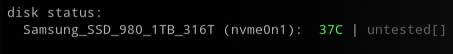
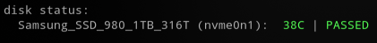
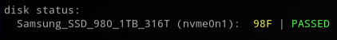

# Message of the Day (MOTD) with ZFS Enhancements

Collection of 'Message of the Day' scripts with ZFS Enhancements

## Requirements

* [update-motd](https://launchpad.net/update-motd)
* [figlet](http://www.figlet.org/) & [lolcat](https://github.com/busyloop/lolcat) (for `10-hostname`)
* [hddtemp](https://savannah.nongnu.org/projects/hddtemp/) (for `36-diskstatus`)
* [smartmontools](https://www.smartmontools.org/) (for `36-diskstatus`)

### How do I set it up?

Copy the files you want in your MOTD to `/etc/update-motd.d/`. Make sure you have the `PrintMotd`
option set to `yes` in your sshd config.

The duplicate files are different versions of the same, use either one of them. E.g. `30-zpool-simple`
will not print usage bars.

The script `36-diskstatus` greps syslog for smartd entries to read last self-test result.
You have to enable smartd monitoring & run regular self-tests for it to display anything.

If you use `50-fail2ban` you should comment out the `compress` option in `/etc/logrotate.d/fail2ban`,
so that the logs are not compressed and can be read by `grep`.


---
The HDDTemp project is falling behind.  It lacks database entries for many not so new technologies.  It should be straight forward to add sensors for SATA SSD devices, but it lacks any NVMe support (see below for workaround).

If `hddtemp` is unable to locate a temperature sensor but `smartctl` shows a sensor attribute exists, it can be added:

```shell
$ sudo hddtemp /dev/sda
WARNING: Drive /dev/sda doesnt seem to have a temperature sensor.
WARNING: This doesnt mean it hasnt got one.
WARNING: If you are sure it has one, please contact me (hddtemp@guzu.net).
WARNING: See --help, --debug and --drivebase options.
/dev/sda: Samsung SSD 840 Series :  no sensor

$ sudo smartctl -a /dev/sda | grep -i temp
190 Airflow_Temperature_Cel 0x0032   077   060   000    Old_age   Always       -       23

```

NOTE: Attribute `194` is common for Hard Drives, however many SSDs use attribute `190` for a temperature sensor, this can be added to the HDDTemp database:

```bash
$ sudo sh -c 'echo \"Samsung SSD \(840\|860\)\" 190 C \"Temp for Samsung SSDs\" >> /etc/hddtemp.db'

# Check entry
$ tail -1 /etc/hddtemp.db
"Samsung SSD (840|860)" 190 C "Temp for Samsung SSDs"
```

_Note: All the `\` characters are required, it tells bash not to interpret the following character, accept it as a literal._

* Field 1: Use a string or regex matching the drive's display name (as reported by hddtemp output)
* Field 2: SMART data field number (190 in this case)
* Field 3: temperature unit (C|F)
* Field 4: label string / comment you define

Once added to the HDDTemp Database, HDDTemp should show device temperature:

```shell
$ sudo hddtemp /dev/sda
/dev/sda: Samsung SSD 840 Series: 22 C
```

---

## Disk Status has Limited NVMe Support

Below shows how support for Samsung NVMe devices is provided in `36-diskstatus` as such:

```bash
#---[ You can updates these ]--------------------------------------------------
# Types of disks to look for. Used by awk to define disk by-id types to include
# IDE/SATA - you might add another for usb "usb-".
findthese="ata-|scsi-SATA_|nvme-Samsung"
```

You can find possible names for your NVMe devices as shown below. Then edit file `36-diskstatus` and update the `findthese=` variable to include the name of your device.

```shell
$ cd /dev/disk/by-id
$ ls -l nvme*

lrwxrwxrwx 1 root root 13 Mar 18 19:56 nvme-eui.002538db114050ce -> ../../nvme0n1
lrwxrwxrwx 1 root root 13 Mar 18 19:56 nvme-Samsung_SSD_980_1TB_S64ANS0RB07316T -> ../../nvme0n1
/nvme0n1
```

Above shows why `nvme-Samsung` string was selected to search for.

### NVMe Device Temperature

The HDD Temp utility does not support NVMe devices.  If `36-diskstatus` script detects a NVMe device, it will try to get the temperature from `smartctl` by looking for `Temperature:` and parsing the value such as `37 Celsius`.



* If you see `untested` (or `PASSED`) that indicates no previous test results could be parsed from log files.  Review `/etc/smartd.conf` file to see if its part of the testing schedule.
* If the script is unable to located any previous test results then it will return whatever the current status from `smartctl` value of `SMART overall-health self-assessment test result:` is such as `PASSED`:



The HDDTemp utility allows devices to report in Celsius or Fahrenheit. If the script had to pull a temperature from `smartctl` and that value was Celsius and you want it converted to Fahrenheit then set this variable to `/bin/true` (set to `/bin/false` for Celsius).

```bash
# hddtemp can already report F or C temperatures for SATA devices.  If this script
# grabs a temp from smartctl and it is reported in "C" set the following to 
# if you want that value converted to F.
convert_c_to_f=/bin/true
```



---

Originally Based on: [https://github.com/yboetz/motd](https://github.com/yboetz/motd)
