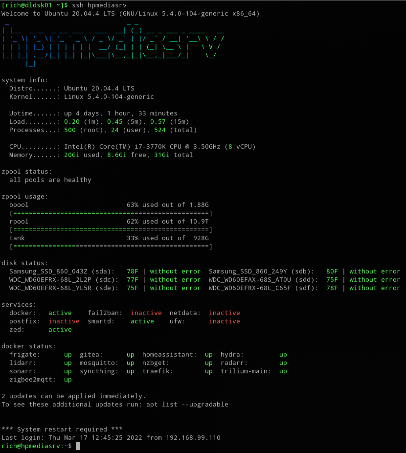
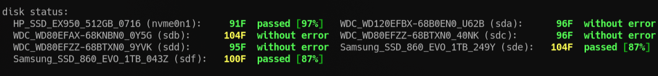

# Message of the Day (MOTD) with ZFS Enhancements

Collection of 'Message of the Day' scripts with ZFS Enhancements

## Requirements

* [update-motd](https://launchpad.net/update-motd)
* [figlet](http://www.figlet.org/) & [lolcat](https://github.com/busyloop/lolcat) (for `10-hostname`)
* [smartmontools](https://www.smartmontools.org/) & [nvme-cli](https://packages.ubuntu.com/search?keywords=nvme-cli)  (for `36-diskstatus`)

### How do I set it up?

Copy the files you want in your MOTD to `/etc/update-motd.d/`. Make sure you have the `PrintMotd`
option set to `yes` in your sshd config.

The duplicate files are different versions of the same, use either one of them. E.g. `30-zpool-simple`
will not print usage bars.

The script `36-diskstatus` will grep either *journalctl* or *syslog* for `smartd` entries to read last self-test result. For non-NVMe devices, you have to enable smartd monitoring & run regular self-tests for it to display anything. The nvme client is required to get NVMe device errors and wear leveling.

If you use `50-fail2ban` you should comment out the `compress` option in `/etc/logrotate.d/fail2ban`,
so that the logs are not compressed and can be read by grep.



---

## HDDTemp Removed

The `hddtemp` utility was once the primary way to monitor and gather drive temperature information.  However HDDTemp project is considered dead and no longer maintained.  It is no longer included in many distribution repositories. Support for `hddtemp` has been removed. This script will get device temperature from `smartctl`.

---

## 36-diskstatus has NVMe Support

Support for NVMe devices is provided in `36-diskstatus` where it will include any device that starts with `nvme-` (in the `/dev/disk/by-id` directory):

```bash
#---[ You can updates these ]--------------------------------------------------
# Types of disks to look for. Used by awk to define disk by-id types to include
# IDE/SATA - you might add another for usb "usb-".
findthese="ata-|scsi-SATA_|nvme-"
```

Then any devices matching `nvme-eui` or `nvme-nvme` are removed from the list.  This should leave just devices with the manufacture name such as Samsung, HP, Sabrent, WD, etc. If you have some odd name detected then you probably need to add another filter here.

```yaml
# This is used by awk to remove unwanted disk devices which matched above.
ignorethese="ata-Samsung|nvme-(eui|nvme).*"
```

Lastly there is a filter which attempts to pretty up the device names for display, for NVMe devices it removes the `nvme-` prefix with the intent that the device name will now start with your manufacture name. It will remove references to `_with_Heatsink` popular with Samsung devices.

```yaml
# This is used by sed to remove text from disk device names. This does not alter
# device selection like ones above.  This just helps to make disk device names
# nicer (smaller).
sed_filter="s/^scsi-SATA_//; s/^ata-//; s/Series_//; s/^nvme-//; s/_with_Heatsink//;"
```

Example Results:

* `Samsung_SSD_980_1TB_316T` is a Samsung device, model 980 with 1 TB capacity with last 4 digits of the serial number `316T`.
* `HP_SSD_EX950_1TB_3005` is a HP (Hewlett Packard) model EX950 with a 1 TB capacity with last 4 digits of serial number `3005`.
* `WDS100T3XHC-00SJG0_2993` shows how horrible WD (Western Digital) names their devices.  This is a WD Black model SN750 but there is no way to know that by the device name. (You could use the filter above to rename if you like)

The idea behind this is should you have many devices and one reports `FAILED`, having part of the serial number will be helpful in identifying which device has a problem.

### NVMe Device Temperature

If `36-diskstatus` script detects a NVMe device, it will scrape the output of  `smartctl` by looking for `Temperature:` and parsing the value such as `38 Celsius`.

```text
disk status:
  Samsung_SSD_980_1TB_316T (nvme0n1):   38C passed [97%]
```

A Celsius temperature from `smartctl` can be converted to Fahrenheit by setting variable `convert_c_to_f` to `/bin/true` (set to `/bin/false` for Celsius).

```bash
# hddtemp can already report F or C temperatures for SATA devices.  If this script
# grabs a temp from smartctl and it is reported in "C" set the following to 
# if you want that value converted to F.
convert_c_to_f=/bin/true
```

```text
disk status:
  Samsung_SSD_980_1TB_316T (nvme0n1):   98F passed [97%]
```

NOTE: Some devices may go into sleep mode and report `SLP` instead of current temperature:

```text
disk status:
  SSSTC_CVB-8D128-HP_F1PA (sda):  SLP | without error
```

---

Example showing a mix of SATA SSDs, SATA HDDs and NVMe devices

* Temperatures are converted to Fahrenheit
* Elevated temperatures are in yellow
* Wear level / life expectancy are expressed as a percentage from 100% and lowers towards 0%



---

### Drive Testing Results

#### Without Error

When the Customized Message of the Day `disk status:` states a drive is `without error` it is parsing that information from the device's last test result:

```text
disk status:
  WDC_WD120EFBX-68B0EN0_U62B (sda):  73F without error
```

* SATA SSD which support a wear level indicator will have the `without error` changed to `passed` to make room for the indicator.  This is a life expectancy expressed as a percentage that starts at 100% and decreases towards 0%.

```text
disk status:
  Samsung_SSD_860_EVO_1TB_043Z (sda):   78F  passed [87%]
```

#### PASSED or FAILED

When a SATA device test result is not found (either not supported, not performed, log purged, etc) then the `smartctl` self assessment status will be displayed which should be a simple `PASSED` or `FAILED!` value.  It is still possible to show `PASSED` and have device issues. This is **not** an equivalent of `without error`.

NVMe device will use the *nvme-cli* to fetch error information from the device. If the last test, a result of zero is `passed` and a non-zero is `error`.  An error indicates you need to investigate the device, start with something like `sudo nvme error-log -e 1 /dev/nvme0n1` to return the last error log entry.

```text
disk status:
  Samsung_SSD_980_1TB_316T (nvme0n1):  98F passed [97%]
```

#### Untested[]

When no test result can be found, and no self assessment value can be obtained from `smartctl` then the device will simply report `untested[]`. If any unexpected result is found that would be shown within the square brackets `[]`.  Empty brackets indicate absolutely nothing was found. This is expected with environments such as Virtual Box.

```text
disk status:
  VBOX_HARDDISK_eb03 (sda):  ERR | untested[] 
```

#### Wear Level Indicator

SATA SSD and NVMe devices which report a detectable wear level indicator or a life expectancy indicator, will be expressed as a percentage that starts at 100% and decreases towards 0%.  `smartctl` attribute names evaluated: `Wear_Leveling_Count` and `Percent_Lifetime_Remain`, NVMe attribute `percentage_used`.

The indicator will remain green until it drops below 30%, it will then be yellow to get your attention. Below 15% will turn red. The device should be replaced.

---

Originally Based on: [https://github.com/yboetz/motd](https://github.com/yboetz/motd)
